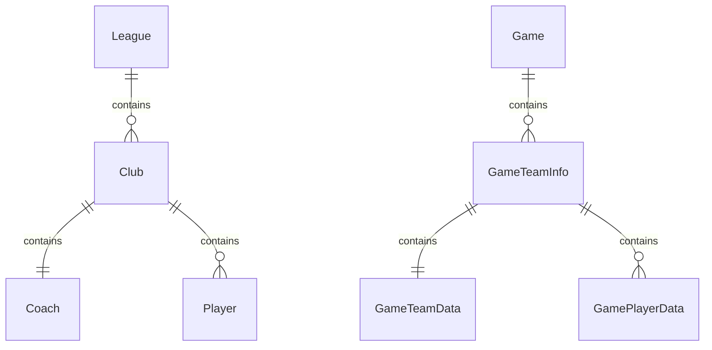
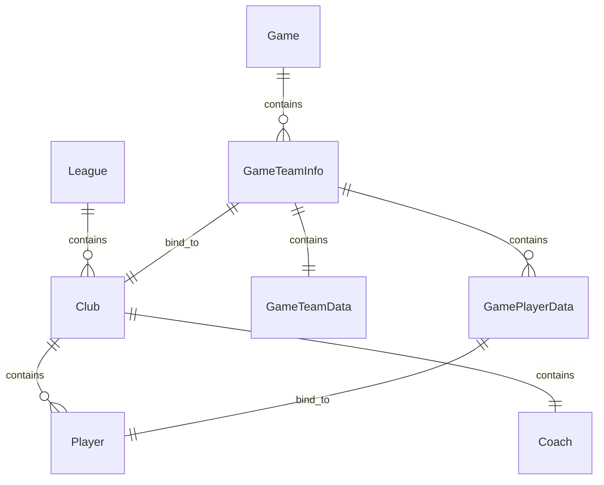

# Petit-FM
## 数据库关系图

## 项目架构
### assets

存储各种资源文件，如国家名称汇总、人名汇总等

- Chinese_names.txt
    - 中文人名
- country_names.py
    - 字典形式，存放国家中文名以及对应的英文名
- English_names.txt
    - 英文人名以及对应的中文翻译
- Japanese_names.txt
    - 日文人名

### club_app

俱乐部类

### coach_app

教练类

### db_file

存放数据库文件的目录

### game_app

比赛类

### info_app

数据统计类，根据具体需求，对数据库中的数据进行汇总、统计，返回需要的内容

### league_app

联赛类

### league_system_app

联赛系统类，将所有联赛汇聚成一个联赛系统

### logs

日志文件夹

### output_data

输出数据文件夹，debug 用

### player_app

球员类

### sql_app

数据库类，负责数据与数据库的创建、读取、修改、删除

### unused

废弃的比赛逻辑

### utils

通用工具类
